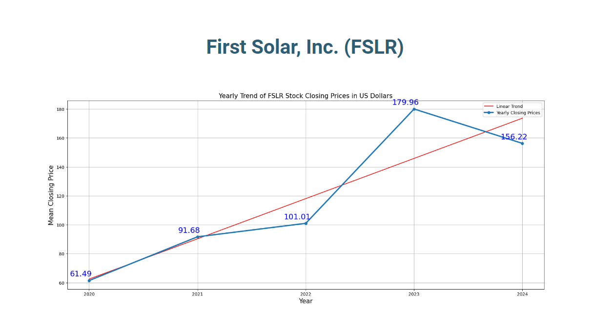
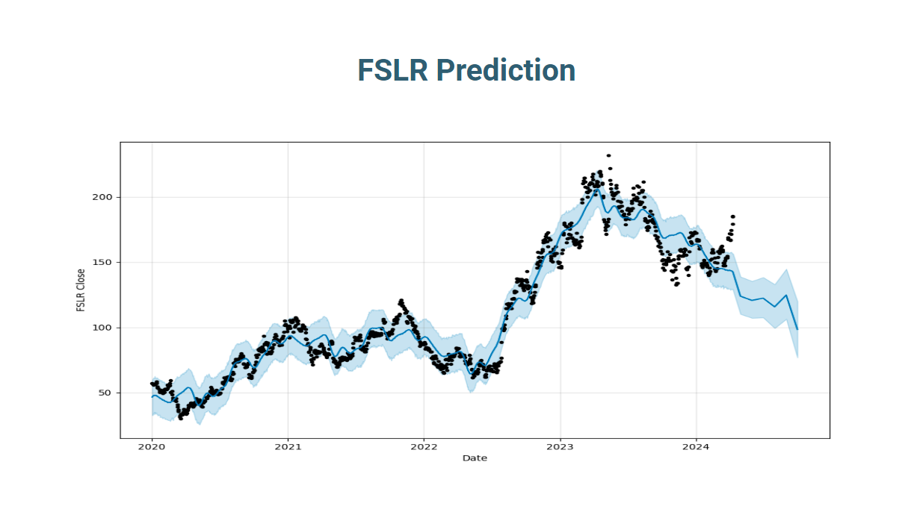
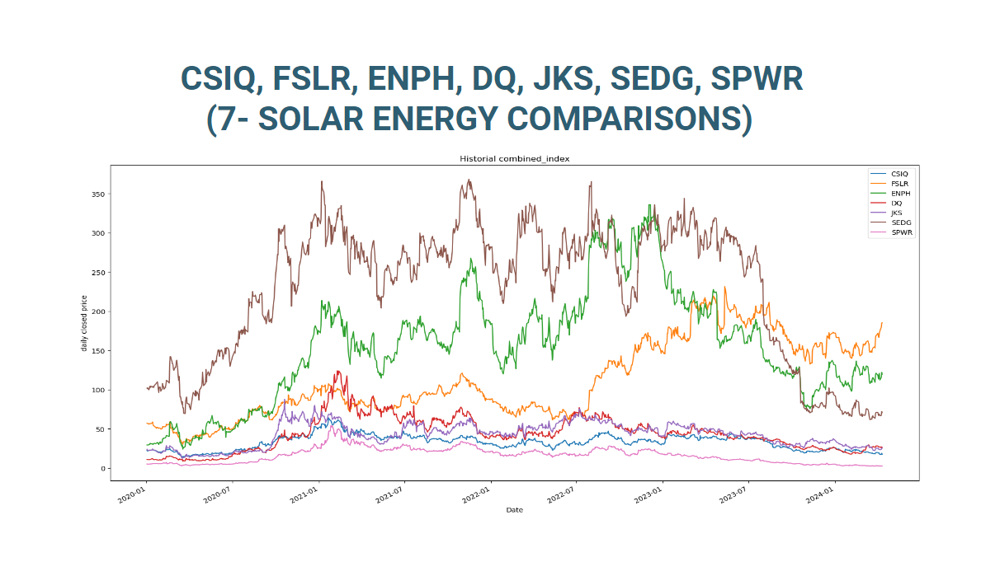
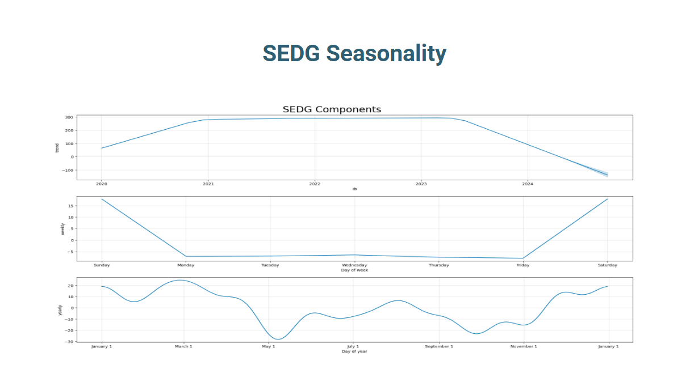

<H1 style="text-align: center;">Natural Juicers</H1>
<H2 style="text-align: center;">Top 7 Solar stock performance evaluation</H2>

## Executive Summary

All of Solar stocks evaluated reflect downward trending and are forecasted to continue to do so in the next six months. It is important to know that these predictive models do not account for unforeseen events, policy changes, economic factors, or even technological advancements that can occur. If our client wants to invest while these stocks are down, it's important to note that historical patterns demonstrated by these models do not guarantee future results.
Buying into a stock during a dip can be a strategy depending on clients’ risk tolerance. Another options could be to diversify a portfolio that can withstand market fluctuations in addition to investing into some of these stocks presented here.
Stocks like ENPH and SEDG which both have seen higher historical price points, might indicate a potential for a more substantial recovery if conditions that helped their last highs were to reemerge. Both however, showed larger fluctuations in both historical data and predicted values, which suggests higher volatility when compared to the other stocks.
DQ seemed to have a less steep decline in its model prediction, which may be indicative of a more stable outlook when compared to the other stocks’ declines. 

## Project Scope
This project aims to develop a data-driven approach to analyzing the stock market. By leveraging historical data and identifying trends, we will create a framework to answer critical questions like which stocks are on the rise, which hold long-term potential, and how different stocks are performing within the Solar market. We will utilize the following questions to help formulate out results: 
- Which stock(s) is trending up or down?
- Which stock(s) is likely to perform the best over the next 6 months based on historical data?
- How are stocks performing compared to each other in this market segment?
- Is there any specific seasonality that shows why this market moves?

## Software Project
- github repo: https://github.com/galedione/project_1_group_2.git
- Supporting files stored in repo
- documentation of individual users checkins and appropriate comments captured and included with code where appropriate
- supporting images captured for each documented analysis stored in root of project

## Data Elements
- Data Elements utilized: 
    - /data directory created in project repo
    - populated with downloaded data from 7 top Solar stocks: (CSIQ, DQ, ENPH, FSLR, JKS, SEDG, SPWR)
    - Common data elements captured: (Date,Open,High,Low,Close,Adj Close,Volume)
- Identified the type of data we would investigate - Selected top 7 Solar stocks to compare and evaluate from 01-01-2020 through 04-10-2024
- Started to utilize Nasdaq data, but it ended requiring subscription. Decided to leverage Yahoo Finance to gather required data
- Took steps to properly cleanse the data and align date/times to ensure full set of representative data was present for all stocks required
- Performed individual review of data by mapping out closing costs and volumes to visualize consistent information
- Performed process to create combined data set for overall comparison while remaining distinct datasets could be used for more specific analysis

## Technical Approach
- Identify stocks for visualization (CSIQ, DQ, ENPH, FSLR, JKS, SEDG, SPWR)
- Linear regression helped uncover long-term trends, guiding the data visualization process
- Performed coded steps to cleanse data and ensure there was a full set of functional data to be used for analysis
- Created a combined data set that would be used to visualize trends for all closing prices at once 
- Individually created time series plots and trends to see stock performance
- Utilized prophet libraries to create predictive trends and extract seasonal trends and visualize

## Conclusion: Which stock(s) is trending up or down?
- Summary: The analysis of the stock trends from 2020 to 2024 provides insights into the performance of each company over the specified period. CSIQ demonstrated an initial increase in 2021 but experienced a continuous decline in subsequent years. DQ, ENPH, and FSLR showed promising growth initially, but their performance faltered in the later years, resulting in a mixed trajectory. JKS experienced growth until 2022, followed by a downturn, while SEDG saw significant growth in 2021 but faced a sharp decline afterward. SPWR exhibited substantial growth until 2021, but its performance declined sharply thereafter. Overall, the trends suggest varying degrees of success and challenges for each company.

    - Example: Remaining images contained in project root

## Conclusion: Which stock(s) is likely to perform the best over the next 6 months based on historical data?
- Summary: Based on the forecasts, none of the stocks indicate a strong likelihood of performance gains within the next six months according to the Prophet model predictions. It is important to note that each stock’s actual future performance can be influenced by many factors that are not included in the model, such as company performance, economic conditions, and global events.

    - Example: Remaining images contained in project root

## Conclusion: How are stocks performing compared to each other in this market segment?
- Summary: Stocks are compared by metrics across investors can gain a comprehensive understanding of how each company is fairing relative to its peers in the solar energy market segment. Additionally, conducting fundamental analysis and considering industry trends and competitive dynamics can further inform investment decisions and by understanding the strengths and weaknesses of each company, to provide insights into their competitive positioning within the solar energy industry. 

    - Example: Remaining images contained in project root

## Conclusion: Is there any specific seasonality that shows why this market moves?
- Summary: Upon completion for each of the seasonality visuals utilizing prophet plot_components function we were able to take a close look at the collective results. Within this Solar market there was not a consistent seasonality identified across all 7 stocks. There is a clear pattern within weekly visual that reflects daily change and weekend stall(during times of no trading). The yearly trends for almost all stocks do show a similarity around the month of May which is correlated with the change in close prices for all companies. The reality for this market segment is there are too many factors that can influence each company stock individually that were not tracked as part of this data analysis.

    - Example: Remaining images contained in project root

## Future Enhancements
- Further data analysis could include performing additional data correlation to produce insights related to volume and closing price.
- The team could create more visuals that would help represent the related data elements and influences that are outside of the information we researched already.
- Our team could incorporate more specific recommendations inclusive of profit and loss metrics to help give a more concise direction for investors. 

## Appendix / Reference
- GitHub repo: https://github.com/galedione/project_1_group_2/tree/main
- Article that spawned research: https://www.nasdaq.com/articles/7-solar-stocks-to-buy-and-hold-for-a-bright-future
- Data source: https://finance.yahoo.com/
- Further research: https://www.forbes.com/advisor/investing/best-solar-power-stocks/
- Annotations - Matplotlib: https://matplotlib.org/stable/users/explain/text/annotations.html
- How to annotate types in a for-loop?: https://stackoverflow.com/questions/41641449/how-do-i-annotate-types-in-a-for-loop 
